<table style="border:0">
	<tr align="center">
		<td>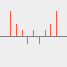</img>&nbsp;&nbsp;</td>
		<td>winw-java 
			<a style="text-decoration:none">https://github.com/winwjava/winw-java</a> 
			<a style="color:black;text-decoration:none" href="mailto:winwjava@sina.com">winwjava@sina.com</a></td>
	</tr>
</table>

# 

#人脑的学习方式是强化学习，认知模型是图模型，计算方式是图运算

##强化学习
人脑的主要学习方式是强化学习，通过基底核、海马体和大脑皮层实现，这已经被神经科学所证实。人工智能的专家们对强化学习已经有了很多研究和应用，DeepMind 发表过一篇深度增强学习的著名文章： Human-level control through deep reinforcement learning，下图比较直观的表示了机器如何通过强化学习变得更加智能。

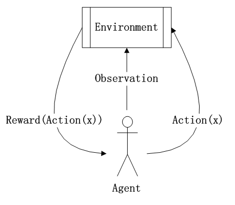 
<!--img width="500px" src="./docs/monkey-memory.png"-->
图1：强化学习中主体（Agent）与环境（Environment）的关系

大脑中的多巴胺对学习记忆以及运动控制至关重要。在多巴胺与学习记忆方面，剑桥大学的Schultz等人在1997年提出了多巴胺的“奖赏预测误差假说 (reward prediction error hypothesis)”，提出多巴胺在巴甫洛夫条件反射式学习期间编码刺激-奖赏预测误差，即实际奖赏与基于该刺激的预期奖赏之间的差异。该理论已被拓展并广泛应用于有关动作抉择的强化学习。

Model-free RL是一种常见的强化学习算法。model-free RL主要依赖frontal-striatal system，如下图所示。在做出某一动作后，会得到来自环境的反馈，多巴胺神经元依此编码RPE，通过影响PFC与纹状体之间突触连接的强度，更新选项与奖赏之间的关系。重复多次后，可学到不同动作与奖赏之间的联系。

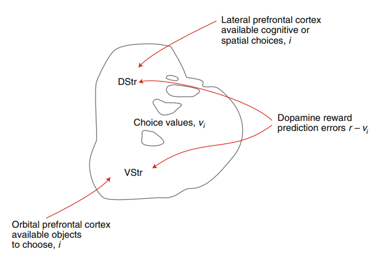

图2：强化学习所依赖的神经机制（简易版），图片来自(Neftci &Averbeck, 2019)

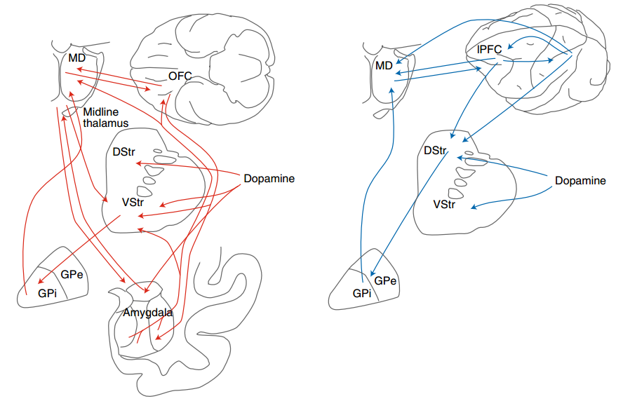

图3：强化学习所依赖的神经机制细致版，其中，用红线表示解剖连接的左图为与腹侧纹状体相连的网络，负责与感知信息相关的价值处理过程。右图为与背侧纹状体相连的网络，负责与空间-认知过程（spatial-cognitive process）相关的价值处理（例如，眼动）。图中所示的只是参与RL过程的部分脑区，并非全部（例如，海马体也参与了该过程）。MD: medial-dorsal thalamus； GPe/GPi: globus pallidus external and internal segments。图片来自(Neftci &Averbeck, 2019)。

http://news.cctv.com/world/20071205/100041.shtml  
http://life.ecnu.edu.cn/da/73/c18135a383603/page.htm  
https://mp.weixin.qq.com/s/mPrHBOu_f7OpyhxZHKTrFA  
Neftci, E. O., & Averbeck, B. B. (2019).Reinforcement learning in artificial and biological systems. Nature Machine Intelligence, 1(3),133-143. doi: 10.1038/s42256-019-0025-4

##主观情绪
情绪系统属于原始脑，在节肢动物、爬行动物、哺乳动物的神经系统中处于核心地位。我们的一切认知最终都会形成主观情绪认知，情绪也主导了动机和运动。比如惊恐、愉悦等等。

情绪在强化学习中扮演了“状态反馈”的角色。对环境的感知会立马反馈到情绪状态上。

情绪状态包含愉悦、惊恐（喜好或厌恶是对事物的主观认知），对学习起到奖赏或惩罚作用。 比如吃到美味的食物，会得到大脑“愉悦”的自我奖赏。我们会积极的获得这种感受，“愉悦”是主观行为动机的源动力。 

大脑中处理“惊恐”的部分有杏仁核，大脑中处理“愉悦”的部分有纹状体（包括被侧纹状体的尾状核和壳核，腹侧纹状体的伏隔核）、苍白球、黒质、中脑腹侧被盖区。依靠大脑的“愉悦”功能，将走马灯一样的短时记忆，强化为认知经验。

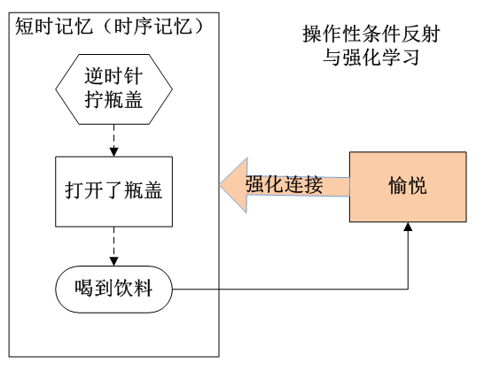

图4：操作性条件反射中的强化学习，猴子通过尝试，拧开饮料瓶盖。尝试拧瓶盖成功后，喝到饮料会触发愉悦奖赏机制，强化了有用的记忆。

“抑郁症/自闭症/焦虑症/精神分裂症” 都属于情绪系统异常。

https://mp.weixin.qq.com/s/v6xXHbZ_NcuS2XaUF37Oyg

##认知模型

大脑通过感知器官可以识别：物体、文字、人脸、语音、方向、位置等等，这些识别的模型以及大脑记忆中的模型都是以“图”为基础的模型。最终通过在自然环境中的强化学习形成庞大的知识图谱。

现在图像识别、人脸识别、语音识别等等都已经在人工智能中被广泛应用，人脸识别是通过提取面部几何特征的方式得到模型，图像识别是通过大量类似图像的训练得到模型。这些模型本质上都是图模型。

2014年的诺贝尔生理学或医学奖由John O’Keefe 、May-Britt Moser 和Edvard Moser 共同获得，表彰他们发现了大脑内部的空间位置细胞、网格细胞。这两种细胞有助于大脑在空间中像GPS一样导航。后来的研究还发现了编码头部朝向的“朝向细胞”、编码边界的“边界细胞”、编码大鼠运动速度的“速度细胞”等。

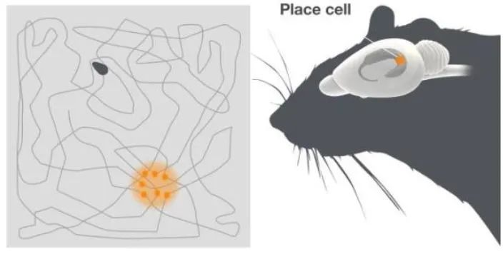

上图描述了大鼠在空地中的移动轨迹，当动物到达特定位置时，海马（右图彩色所示位置）的位置细胞高速发放电信号。

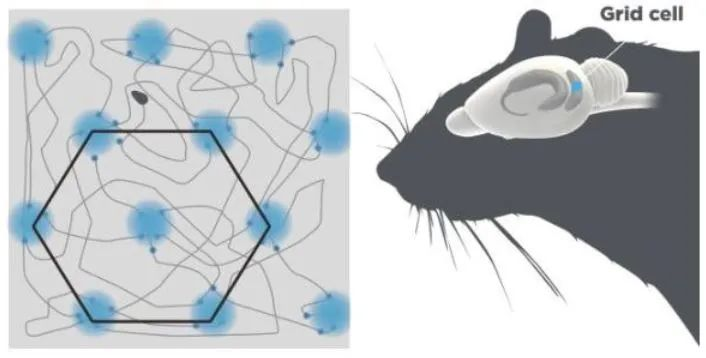

上图内嗅皮层（右图蓝色指示部位）的网格细胞在大鼠经过六边形网格的节点时发放电信号。

神经科学的这个发现当时给了我非常深刻的印象，不仅找到了大脑中抽象的空间位置表达模型，我认为这也是图模型在大脑认知模型中的最有力的证据（拓扑图是图模型中的一种）。其他的认知行为也与此类似，比如物体识别、形状识别等等。

https://doi.org/10.1016/j.cell.2021.07.010
https://mp.weixin.qq.com/s/to9ns244qvlyfarEQpD0xw

##时间印记
科学家研究表明，人类大脑海马体中存在一种“时间细胞”，时间细胞的链式信号反映了事件的时间顺序。对于一般的强化学习来说，主观行动Action和行动结果Reward的关系在被学习之前必须存在某种联系，这种联系大部分是有时间先后顺序的关系，而时间细胞组成的时间联系是强化学习的最佳介导关系（空间位置或其他关系也可以）。

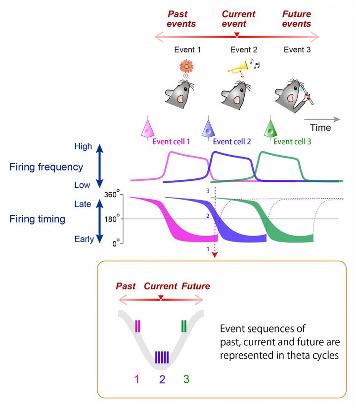

上图描述了大鼠大脑的“事件细胞”（或称“时间细胞”）序列记录了过去事件（味道）、当前事件（声音）和将来事件的关系，组成theta循环。

参考
https://medicalxpress.com/news/2017-06-brain-hippocampus-memories-events.html#jCp

##时序记忆

神经细胞天然带有记忆功能，大脑皮层中的记忆调节维护方式有：长时程增强、长时程抑制，通俗的讲是用进废退。
人脑对特定事物认知后会形成的固定记忆，或可称为概念，科学家已经证实大脑中存在概念细胞，神经科学还发现了对特定运动的记忆会形成时序记忆。

我认为人脑中的记忆大部分是多个视觉片段或语音片段拼凑而成，图模型又是每个片段的基本元素。与计算机的二进制类似，图模型是大脑的基本存储和计算单元。
大脑的视觉系统非常奇妙，视网膜的对比度功能可形成物体轮廓（线条、纹理、形状等），双眼视差有助于建立物体的三维立体模型，还有颜色、方向、运动信息也被传递到大脑视觉皮层。最终在脑海中呈现出了与现实世界非常相似的虚拟映像。

实验1：猕猴对视觉运动信号的感知和检测

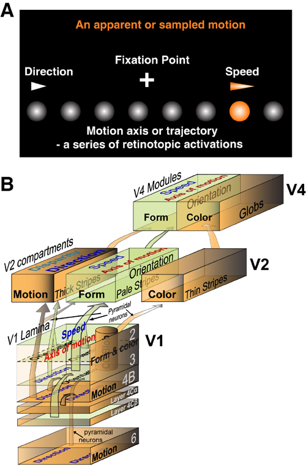

A.以动漫中的采样运动为例，图示视觉运动三个特征构成组分: 运动方向、运动速度和运动轨迹。每个霓红灯泡按时间先后顺序，从左到右依次点亮和关闭（闪烁），霓红灯泡之间的闪烁间隔时间在一定范围内，将产生闪烁光斑从左到右运动的错觉。该运动感知不涉及像汽车运动或子弹在飞那样的闪烁霓红灯泡在空间上从左到右的真正位移，而是不同霓红灯泡按时间的先后顺序静止闪烁。
B.结果示意图。本研究发现在猕猴腹侧视觉通路中，V1，V2和V4视区方位功能构筑中的神经元，不仅能够编码轮廓方位和朝向信息，而且还可以编码运动轨迹和速度信息，二者紧密相关。而在V2视区CO染色深的粗条带中的方向敏感性神经元群体对运动方向偏好的编码与运动速度无关。研究结果和发现揭示，灵长类腹侧视觉系统中的各级方位选择性神经元，可以通过神经元感受野线性时空整合机制，编码视网膜上的物体运动轨迹和运动速度，进而感知物体运动。

实验2：延时空间序列回忆任务

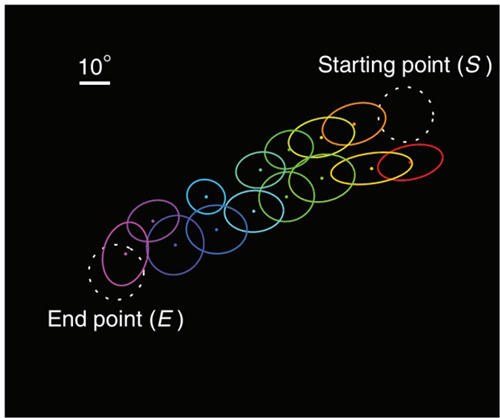

上图彩色椭圆为多道电极阵列记录到的神经元集群的感受野。白色虚线圆圈为训练光点的起始位置(S)和终止位置(E)。训练过程中，光点反复从S运动到E，从而反复地引起感受野排布在此路径上的神经元的顺序激活。训练后，即使仅在S闪现一个静止光点也可更频繁地诱发出类似于运动光点所引起的全序列放电。

上面两个实验简单展示了大脑视觉系统对运动信息（时序信息）的采集，以及时序信息（空间位置信息、时间顺序信息）记忆的编码和存储方式。但现在还不能确定时间顺序与空间位置是分开编码，还是联合编码（想象几种烟花的盛开瞬间）。

参考：  
http://www.ion.ac.cn/kpwz/201907/t20190703_5332551.html  
http://www.ion.ac.cn/xwen/kyjz/2015njyq/201910/t20191010_5406324.html  
http://www.ion.ac.cn/xwen/kyjz/2015njyq/201202/t20120214_5315828.html  
http://www.ion.ac.cn/xwen/kyjz/2022n/202202/t20220210_6354155.html  
http://www.ion.ac.cn/xwen/mtsm/2019n/202202/t20220215_6355476.html 群体神经元

##工作记忆
Neuron：短时记忆形成的新环路机制

工作记忆在大脑中广泛分布，任意一组概念的神经细胞都可以借助海马体（或者基底核的SNr？）瞬间组成工作记忆。

TODO
https://zhuanlan.zhihu.com/p/105829659?utm_source=wechat_session

https://doi.org/10.1016/j.neuron.2021.08.002  
https://mp.weixin.qq.com/s/5dTgtxajZYOzpXcRZZAZNA  
http://www.ion.ac.cn/xwen/mtsm/2019n/202202/t20220215_6355476.html 群体神经元

##立体视觉
大脑的视觉皮层根据视觉感受器传回的光信号，通过V1、V2，到V4整合为立体视觉，双眼视差也起到了重要作用。进一步可以提取空间位置信息。

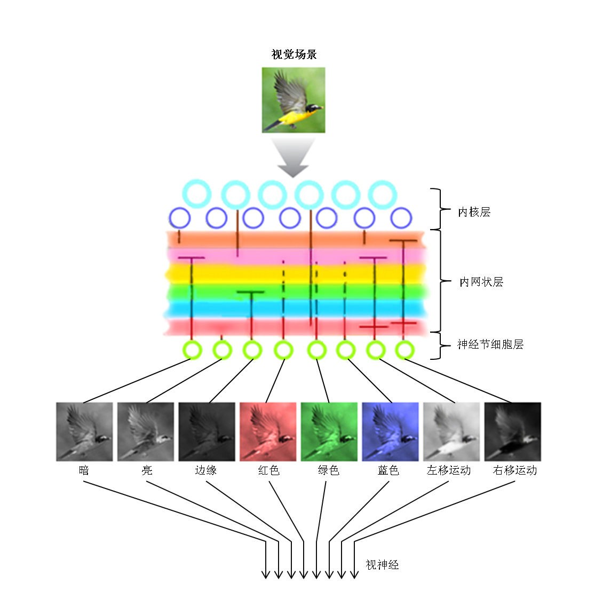

计算机视觉（Computer Vision）已经通过卷积神经网络等技术实现了图像识别、文字识别、人脸识别等等。

3D相机（中原动力），3D视觉认知、3D视觉识别，单目相机的三维重建、多目相机阵列三维重建/物体位姿估计

##计算模型

现代计算机发展所遵循的基本结构形式始终是冯·诺依曼机体系结构。而冯·诺依曼机的模型本质上也是一个图灵机（1936年阿兰·图灵提出的一种抽象的计算模型），图灵机模型如下图：

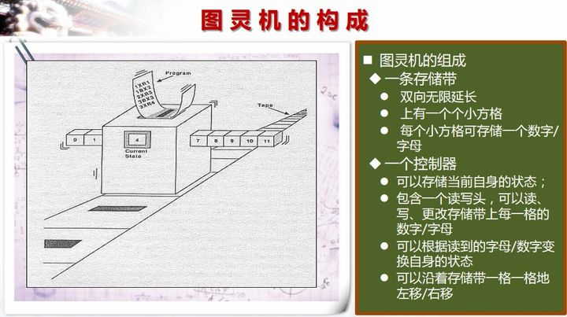
<!--img width="500px" src="./docs/turing-2.jpg"-->

https://blog.csdn.net/hemeinvyiqiluoben/article/details/54617388

大脑的计算模型与图灵机类似，依赖图模型，图模型的变换和运算是大脑的运算方式，大脑的海马区（三突触回路 ）是这个模型的关键。

英国牛津大学的David Dupret实验室的研究人员设计了巧妙的三阶推导任务 (图1A-B)，使得在清醒状态下完成推导任务并同时检测脑活动性成为可能。这一任务横跨数日 (图1C-D)，由三阶段组成：(1) 第一阶段：观测学习 (observational learning)，训练受试者或小鼠将听觉线索和视觉线索关联起来。(2) 第二阶段：条件反射 (conditioning)，建立视觉线索和奖赏预后的关联。其中一个正性线索关联奖赏预后，另一个中性线索关联中性预后。(3) 第三阶段：推导测试 (inference test)，检测受试者或小鼠如何不经过视觉而仅通过听觉线索来预测奖赏预后。研究人员给与人类受试者虚拟环境训练，而对于小鼠则使用开场箱训练。在条件关联阶段，受试者和小鼠能有效区分两个不同预后的线索，而随后的推导测试阶段，相应听觉线索也能很好的让受试者或小鼠做出正确的奖赏寻求 (reward-seeking)行为选择，因此证明了这一行为范式的有效性。下图是实验使用的三阶推导任务：

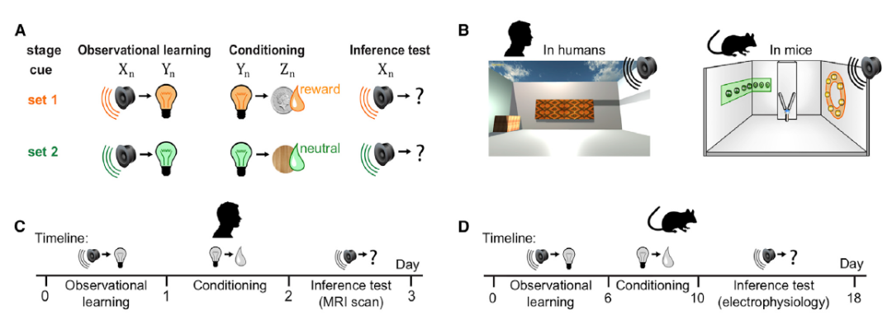

下图是牛津大学以小鼠作为研究对象，研究人员记录了分别代表声音、灯光或奖励的脑细胞活动。当小鼠开始通过灯光推断声音与奖励存在逻辑上的关联时，他们发现细胞按此顺序激活。

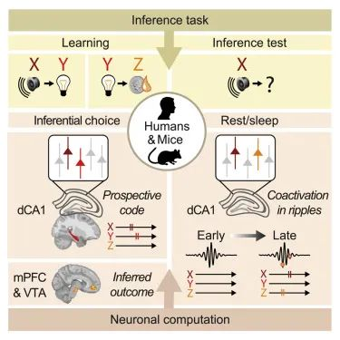

不过，在小鼠完成任务后，他们继续监控小鼠。他们发现，小鼠大脑开始跳过中间的“灯光”步骤。“声音”脑细胞与“奖励”脑细胞一起变得活跃，将不同经验之间的点点滴滴联系起来。

牛津大学的David Dupret博士表示：“这些结果表明，当小鼠在休息的时候，它们的大脑在之前未直接经历的事物之间建立了新的关联。我们认为正是这一过程将有助于它们在将来做出有用的决策。”

DOI: https://doi.org/10.1016/j.cell.2020.08.035
Neuronal Computation Underlying Inferential Reasoning in Humans and Mice

##感知抉择

依靠感知、情绪、运算，做选择

最后，在两种脸部分辨任务中，如果呈现完全相同的视觉刺激，只改变规则：一种规则是判断人脸还是猴脸，一种规则是判断开心还是难过，在这种情况下神经的后台计算相同吗？研究人员对这两种规则下的LIP神经元做了同样的分析，结果发现只要任务的规则不同，它们在状态空间内的曲度流形就不一样，在放电频率轴上的投射角度也不一样。这个结果说明，在任务感官刺激完全相同的情况下，游戏规则的改变也会改变神经元的编码计算。

决策的标志之一就是它的灵活性，为了做出灵活的决策，大脑必须能够掌握不同背景下的信息，懂得其中的深层规则来指导行动。本文对LIP神经元在不同任务中的空间曲度流形分析，或许能为决策行为的发生提供新的思路。

https://zhuanlan.zhihu.com/p/61738979  
Wikenheiser et al., Suppression of Ventral Hippocampal Output Impairs Integrated Orbitofrontal Encoding of Task Structure, Neuron (2017).   
https://doi.org/10.1016/j.cell.2021.05.022