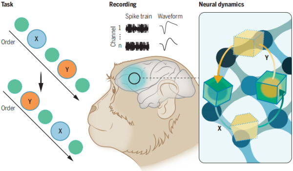

<table style="border:0">
	<tr align="center">
		<td></img>&nbsp;&nbsp;</td>
		<td>winw-java 
			<a style="text-decoration:none">https://github.com/winwjava/winw-java</a> 
			<a style="color:black;text-decoration:none" href="mailto:winwjava@sina.com">winwjava@sina.com</a></td>
	</tr>
</table>

# 

#人脑的学习方式是强化学习，认知模型是图模型，计算方式是图运算

##强化学习

大脑中的多巴胺对学习记忆以及运动控制至关重要。在多巴胺与学习记忆方面，剑桥大学的Schultz等人在1997年提出了多巴胺的“奖赏预测误差假说 (reward prediction error hypothesis)”，提出多巴胺在巴甫洛夫条件反射式学习期间编码刺激-奖赏预测误差，即实际奖赏与基于该刺激的预期奖赏之间的差异。该理论已被拓展并广泛应用于有关动作抉择的强化学习。

Model-free RL是一种常见的强化学习算法。model-free RL主要依赖frontal-striatal system，如下图所示。在做出某一动作后，会得到来自环境的反馈，多巴胺神经元依此编码RPE，通过影响PFC与纹状体之间突触连接的强度，更新选项与奖赏之间的关系。重复多次后，可学到不同动作与奖赏之间的联系。

图1：强化学习所依赖的神经机制（简易版），图片来自(Neftci &Averbeck, 2019)

图2：强化学习所依赖的神经机制细致版，其中，用红线表示解剖连接的左图为与腹侧纹状体相连的网络，负责与感知信息相关的价值处理过程。右图为与背侧纹状体相连的网络，负责与空间-认知过程（spatial-cognitive process）相关的价值处理（例如，眼动）。图中所示的只是参与RL过程的部分脑区，并非全部（例如，海马体也参与了该过程）。MD: medial-dorsal thalamus； GPe/GPi: globus pallidus external and internal segments。图片来自(Neftci &Averbeck, 2019)。

人脑的主要学习方式是强化学习，通过基底核、海马体和大脑皮层实现，这已经被神经科学所证实。人工智能的专家们对强化学习已经有了很多研究和应用，DeepMind 发表过一篇深度增强学习的著名文章： Human-level control through deep reinforcement learning，强化学习中主体与环境的关系模型见下图。

 
<!--img width="500px" src="./docs/monkey-memory.png"-->
图3：强化学习中主体（Agent）与环境（Environment）的关系

http://life.ecnu.edu.cn/da/73/c18135a383603/page.htm  
https://mp.weixin.qq.com/s/mPrHBOu_f7OpyhxZHKTrFA  
Neftci, E. O., & Averbeck, B. B. (2019).Reinforcement learning in artificial and biological systems. Nature Machine Intelligence, 1(3),133-143. doi: 10.1038/s42256-019-0025-4

##主观情绪
情绪系统属于原始脑，在节肢动物、爬行动物、哺乳动物的神经系统中处于核心地位。我们的一切认知最终都会形成主观情绪认知，情绪也主导了动机和运动。比如惊恐、愉悦等等。

情绪在强化学习中扮演了“状态反馈”的角色。对环境的感知会立马反馈到情绪状态上。

情绪状态包含愉悦、惊恐（喜好或厌恶是对事物的主观认知），对学习起到奖赏或惩罚作用。 比如吃到美味的食物，会得到大脑“愉悦”的自我奖赏。我们会积极的获得这种感受，“愉悦”是主观行为动机的源动力。 

大脑中处理“惊恐”的部分有杏仁核，大脑中处理“愉悦”的部分有纹状体（包括被侧纹状体的尾状核和壳核，腹侧纹状体的伏隔核）、苍白球、黒质、中脑腹侧被盖区。依靠大脑的“愉悦”功能，将走马灯一样的短时记忆，强化为认知经验。

图4：操作性条件反射中的强化学习，猴子通过尝试，拧开饮料瓶盖。尝试拧瓶盖成功后，喝到饮料会触发愉悦奖赏机制，强化了有用的记忆。

“抑郁症/自闭症/焦虑症/精神分裂症” 都属于情绪系统异常。

https://mp.weixin.qq.com/s/v6xXHbZ_NcuS2XaUF37Oyg

##认知模型

大脑通过感知器官可以识别：物体、文字、人脸、语音、方向、位置等等，这些识别的模型以及大脑记忆中的模型都是以“图”为基础的模型。最终通过在自然环境中的强化学习形成庞大的知识图谱。

现在图像识别、人脸识别、语音识别等等都已经在人工智能中被广泛应用，人脸识别是通过提取面部几何特征的方式得到模型，图像识别是通过大量类似图像的训练得到模型。这些模型本质上都是图模型。

2014年的诺贝尔生理学或医学奖由John O’Keefe 、May-Britt Moser 和Edvard Moser 共同获得，表彰他们发现了大脑内部的空间位置细胞、网格细胞。这两种细胞有助于大脑在空间中像GPS一样导航。后来的研究还发现了编码头部朝向的“朝向细胞”、编码边界的“边界细胞”、编码大鼠运动速度的“速度细胞”等。

上图描述了大鼠在空地中的移动轨迹，当动物到达特定位置时，海马（右图彩色所示位置）的位置细胞高速发放电信号。

上图内嗅皮层（右图蓝色指示部位）的网格细胞在大鼠经过六边形网格的节点时发放电信号。

神经科学的这个重大发现打开了大脑记忆模型的大门，找到了大脑中抽象的空间位置表达模型（图表征），我认为这是图模型在大脑认知模型中的最有力的证据（拓扑图是图模型中的一种）。其他的认知行为也与此类似，比如物体识别、形状识别等等。

在CVPR-2019中，剑桥大学提出了一种新的占据网络模型： Occupancy Networks，一种新的基于学习的三维重建方法。占据网络隐式地将三维曲面表示为深度神经网络分类器的连续决策边界。

https://doi.org/10.1016/j.cell.2021.07.010
https://mp.weixin.qq.com/s/to9ns244qvlyfarEQpD0xw
https://github.com/LMescheder/Occupancy-Networks
CVPR-2019 Occupancy Networks: Learning 3D Reconstruction in Function Space

##时间印记
科学家研究表明，人类大脑海马体中存在一种“时间细胞”，时间细胞的链式信号反映了事件的时间顺序。对于一般的强化学习来说，主观行动Action和行动结果Reward的关系在被学习之前必须存在某种联系，这种联系大部分是有时间先后顺序的关系，而时间细胞组成的时间联系是强化学习的最佳介导关系（空间位置或其他关系也可以）。

上图描述了大鼠大脑的“事件细胞”（或称“时间细胞”）序列记录了过去事件（味道）、当前事件（声音）和将来事件的关系，组成theta循环。

参考
https://medicalxpress.com/news/2017-06-brain-hippocampus-memories-events.html#jCp

##时序记忆

神经细胞天然带有记忆功能，大脑皮层中的记忆调节维护方式有：长时程增强、长时程抑制，通俗的讲是用进废退。
人脑对特定事物认知后会形成的固定记忆，或可称为概念，科学家已经证实大脑中存在概念细胞，神经科学还发现了对特定运动的记忆会形成时序记忆。

我认为人脑中的记忆大部分是多个视觉片段或语音片段拼凑而成，图模型又是每个片段的基本元素。与计算机的二进制类似，图模型是大脑的基本存储和计算单元。
大脑的视觉系统非常奇妙，视网膜的对比度功能可形成物体轮廓（线条、纹理、形状等），双眼视差有助于建立物体的三维立体模型，还有颜色、方向、运动信息也被传递到大脑视觉皮层。最终在脑海中呈现出了与现实世界非常相似的虚拟映像。

实验1：猕猴对视觉运动信号的感知和检测

A.以动漫中的采样运动为例，图示视觉运动三个特征构成组分: 运动方向、运动速度和运动轨迹。每个霓红灯泡按时间先后顺序，从左到右依次点亮和关闭（闪烁），霓红灯泡之间的闪烁间隔时间在一定范围内，将产生闪烁光斑从左到右运动的错觉。该运动感知不涉及像汽车运动或子弹在飞那样的闪烁霓红灯泡在空间上从左到右的真正位移，而是不同霓红灯泡按时间的先后顺序静止闪烁。
B.结果示意图。本研究发现在猕猴腹侧视觉通路中，V1，V2和V4视区方位功能构筑中的神经元，不仅能够编码轮廓方位和朝向信息，而且还可以编码运动轨迹和速度信息，二者紧密相关。而在V2视区CO染色深的粗条带中的方向敏感性神经元群体对运动方向偏好的编码与运动速度无关。研究结果和发现揭示，灵长类腹侧视觉系统中的各级方位选择性神经元，可以通过神经元感受野线性时空整合机制，编码视网膜上的物体运动轨迹和运动速度，进而感知物体运动。

实验2：延时空间序列回忆任务

上图彩色椭圆为多道电极阵列记录到的神经元集群的感受野。白色虚线圆圈为训练光点的起始位置(S)和终止位置(E)。训练过程中，光点反复从S运动到E，从而反复地引起感受野排布在此路径上的神经元的顺序激活。训练后，即使仅在S闪现一个静止光点也可更频繁地诱发出类似于运动光点所引起的全序列放电。

上面两个实验简单展示了大脑视觉系统对运动信息（时序信息）的采集，以及时序信息（空间位置信息、时间顺序信息）记忆的编码和存储方式。但现在还不能确定时间顺序与空间位置是分开编码，还是联合编码（想象几种烟花的盛开瞬间）。

参考：  
http://www.ion.ac.cn/kpwz/201907/t20190703_5332551.html  
http://www.ion.ac.cn/xwen/kyjz/2015njyq/201910/t20191010_5406324.html  
http://www.ion.ac.cn/xwen/kyjz/2015njyq/201202/t20120214_5315828.html  
http://www.ion.ac.cn/xwen/kyjz/2022n/202202/t20220210_6354155.html  
http://www.ion.ac.cn/xwen/mtsm/2019n/202202/t20220215_6355476.html 群体神经元

##工作记忆
Neuron：短时记忆形成的新环路机制

工作记忆在大脑中广泛分布，任意一组概念的神经细胞都可以借助海马体（或者基底核的SNr？）瞬间组成工作记忆。

研究显示，对空间序列记忆信息进行重新排序时，在记忆期1里不同次序的子空间中的位置信息会从原本的子空间中消失，而后在记忆期2中依据新的顺序将原本的信息放入其对应次序的子空间中。这犹如两个盒子分别装着红球和绿球，当排序发生后红球绿球一起从自己的盒子中消失，而后又神奇地出现在了对方的盒子中。进一步，研究通过跨时间解码分析验证发现，在不同次序所在的子空间中，若不发生排序操作，则各自原本的空间记忆信息随时间保持稳定，而若发生排序，则各自的空间记忆信息在记忆期1到2的过程中发生了交换。研究对错误试次的分析发现，若是本不应排序的时候发生了重排，则在对应空间中也能够发现这些错误的交换信号。

进一步，研究发现，在对不同子空间之间的信息进行交换时，每个子空间额外招募了一个临时存储自己信息的新的子空间。每个子空间先把原先内部的记忆信息传递给新的临时子空间，待到自身内部的记忆被清空之后，再将临时子空间中的记忆信号传递给对方。这便完成了子空间之间记忆信息的交换。研究人员通过临时子空间和次序记忆子空间中信号强度与动力学时间特征的关联分析，证明了找到的临时子空间确实用于存储和交换记忆信号。

猕猴额叶皮层对空间序列信息的工作记忆编程

TODO
https://zhuanlan.zhihu.com/p/105829659?utm_source=wechat_session

https://doi.org/10.1016/j.neuron.2021.08.002  
https://mp.weixin.qq.com/s/5dTgtxajZYOzpXcRZZAZNA  
http://www.ion.ac.cn/xwen/mtsm/2019n/202202/t20220215_6355476.html 群体神经元
https://www.cas.cn/zt/sszt/75yq/cg/202410/t20241001_5034738.shtml

##立体视觉
大脑的视觉皮层根据视觉感受器传回的光信号，通过V1、V2，到V4整合为立体视觉，双眼视差也起到了重要作用。进一步可以提取空间位置信息。

计算机视觉（Computer Vision）已经通过卷积神经网络等技术实现了图像识别、文字识别、人脸识别等等。

3D相机（中原动力），3D视觉认知、3D视觉识别，单目相机的三维重建、多目相机阵列三维重建/物体位姿估计

##计算模型

现代计算机发展所遵循的基本结构形式始终是冯·诺依曼机体系结构。而冯·诺依曼机的模型本质上也是一个图灵机（1936年阿兰·图灵提出的一种抽象的计算模型），图灵机模型如下图：

<!--img width="500px" src="./docs/turing-2.jpg"-->

https://blog.csdn.net/hemeinvyiqiluoben/article/details/54617388

大脑的计算模型与图灵机类似，依赖图模型，图模型的变换和运算是大脑的运算方式，大脑的海马区（三突触回路 ）是这个模型的关键。

英国牛津大学的David Dupret实验室的研究人员设计了巧妙的三阶推导任务 (图1A-B)，使得在清醒状态下完成推导任务并同时检测脑活动性成为可能。这一任务横跨数日 (图1C-D)，由三阶段组成：(1) 第一阶段：观测学习 (observational learning)，训练受试者或小鼠将听觉线索和视觉线索关联起来。(2) 第二阶段：条件反射 (conditioning)，建立视觉线索和奖赏预后的关联。其中一个正性线索关联奖赏预后，另一个中性线索关联中性预后。(3) 第三阶段：推导测试 (inference test)，检测受试者或小鼠如何不经过视觉而仅通过听觉线索来预测奖赏预后。研究人员给与人类受试者虚拟环境训练，而对于小鼠则使用开场箱训练。在条件关联阶段，受试者和小鼠能有效区分两个不同预后的线索，而随后的推导测试阶段，相应听觉线索也能很好的让受试者或小鼠做出正确的奖赏寻求 (reward-seeking)行为选择，因此证明了这一行为范式的有效性。下图是实验使用的三阶推导任务：

下图是牛津大学以小鼠作为研究对象，研究人员记录了分别代表声音、灯光或奖励的脑细胞活动。当小鼠开始通过灯光推断声音与奖励存在逻辑上的关联时，他们发现细胞按此顺序激活。

不过，在小鼠完成任务后，他们继续监控小鼠。他们发现，小鼠大脑开始跳过中间的“灯光”步骤。“声音”脑细胞与“奖励”脑细胞一起变得活跃，将不同经验之间的点点滴滴联系起来。

牛津大学的David Dupret博士表示：“这些结果表明，当小鼠在休息的时候，它们的大脑在之前未直接经历的事物之间建立了新的关联。我们认为正是这一过程将有助于它们在将来做出有用的决策。”

DOI: https://doi.org/10.1016/j.cell.2020.08.035
Neuronal Computation Underlying Inferential Reasoning in Humans and Mice

##感知抉择

依靠感知、情绪、运算，做选择

最后，在两种脸部分辨任务中，如果呈现完全相同的视觉刺激，只改变规则：一种规则是判断人脸还是猴脸，一种规则是判断开心还是难过，在这种情况下神经的后台计算相同吗？研究人员对这两种规则下的LIP神经元做了同样的分析，结果发现只要任务的规则不同，它们在状态空间内的曲度流形就不一样，在放电频率轴上的投射角度也不一样。这个结果说明，在任务感官刺激完全相同的情况下，游戏规则的改变也会改变神经元的编码计算。

决策的标志之一就是它的灵活性，为了做出灵活的决策，大脑必须能够掌握不同背景下的信息，懂得其中的深层规则来指导行动。本文对LIP神经元在不同任务中的空间曲度流形分析，或许能为决策行为的发生提供新的思路。

https://zhuanlan.zhihu.com/p/61738979  
Wikenheiser et al., Suppression of Ventral Hippocampal Output Impairs Integrated Orbitofrontal Encoding of Task Structure, Neuron (2017).   
https://doi.org/10.1016/j.cell.2021.05.022

##视网膜

视网膜感受野，分为：边缘、运动方向、明暗变化 模拟视网膜同心圆感受野，根据光线明暗对比度，分析出边界。 

同心圆结构模型：中心区域若干像素（7个像素），周围相邻圆环若干像素（）。 

根据中间一个像素点和周围8个，或者 

70%的视网膜神经节细胞具有明显的方位选择性 

加拿大神经生理学家David Hunter Hubel和瑞典神经科学家Torsten Nils Wiesel在20世纪50年代和60年代开始研究视觉机制，他们将图像投射到屏幕上，将测量神经元活动的电线插入猫的大脑，通过固定猫的头部来控制视网膜上的成像，测试生物细胞对线条、直角、边缘线等图形的反应。 研究显示有些细胞对某些处在一个角度上的线条、垂直线条、直角或者明显的边缘线，都有特别的反应，这就是绝大多数视皮层细胞都具有的强烈的方位选择性。不仅如此，要引起这个细胞反应，直线的朝向还只能落在一个很小的角度范围里，也就是该细胞的感受野内。这样以上两个研究就统一起来了。 从1960年到1980年，两人合作了20多年，细致科学地研究了人眼视觉的机制，因此他们被认为是现代视觉科学之父，并于1981年一起获得了诺贝尔生理学与医学奖。 

https://www.cnblogs.com/koala999/articles/16989285.html 

https://daily.zhihu.com/story/9314332?yidian_docid=0FwfRRDb&utm_id=0

##表面亮度

相同亮度区域，表面并不是空的，大量感受野组成的区域会汇聚为一个表面，自动分组。表面上的纹理，可以被分离。

在V1输入层（L4C）中，神经元对表面亮度的反应很强，尽管弱于边界反应，但其编码表面亮度信息的能力是强于边界反应的。 

综上，这项研究完整刻画了物体表面亮度信息在V1的编码形式和潜在的神经机制：层间的前馈连接同时驱动了表面反应和边界反应，前馈信号的局部整合提高了边界反应对亮度信息的编码能力。视皮层内的抑制主要抑制了表面反应，并将更多的亮度信息分配给了边界反应。这两个皮层过程结合在一起，将表面亮度信息整合到边界反应中，从而实现基于边界反应的效率编码。该文揭示的亮度信息处理方式，与邢大军课题组在2020年揭示的有关朝向信息（客体形状纹理相关）的皮层处理方式高度一致10。 

http://keyanyuan.bnu.edu.cn/yxfc/243329.html

往往物体表面的明暗变化在一个区域是有规律的，例如：相同、渐变、梯度变化。这有助于视觉区域的分割

##视觉皮层功能柱
对 V1 皮层方向选择性的研究结果使得 Hubel 与 Wiesel 获得了 1981 年的诺贝尔奖。
Hubel和Wiesel根据对视觉刺激的反应特征，在视皮层发现了多种神经元，分别叫做简单细胞、复杂细胞以及超复杂细胞。他们后续的研究以及后来大量科研工作者的实验对这些不同细胞的功能进行了深入的探索。他们的另外一项重要发现则是在视皮层中证实了之前由Vernon Mountcastle(1918--2015)根据其在躯体感觉皮层的研究提出的皮层功能柱的结构。他们的发现可以简单描述为许多具有相同特性的皮层细胞，在视皮层内按照一定的规则在空间上排列起来，这种按功能排列的皮层结构，即皮层的功能构筑，沿着皮层的不同层次呈现柱状分布，例如方向柱、方位柱、眼优势柱、空间频率柱以及颜色柱等。这一结构的形成对于皮层内感觉信息的处理具有重要的影响。 

有4种类型视皮层神经元。 
1. 简单细胞。感受野面积较小，给光区和撤光区分离，有较明显的空间总合，反应具有线性特征，没有或很少有自发放电。具有特定方向和在视野中有固定位置的刺激，最能激发简单细胞。 》》简单型：感受野呈狭长型，分给光区和撤光区，最佳刺激是线条。具有最佳朝向的线条（与给光区朝向相同）能诱发最强反应，反之则抑制。 
2. 复杂细胞。给光区和撤光区重叠，反应具有非线性特征，空间总合不明显，自发放电强。相比简单细胞：①反应要求一定方位的线性刺激，但不管在视野中的部位如何；②当光线移过视野时，能继续激发对适当方位的线性刺激。由此，复杂细胞对于适当方位的移动的直线刺激能继续激发，可以认为它们接受大量的简单细胞输入的刺激。 》》复杂型：感受野较大，无明显光区、线条方向检测，只对朝向敏感，对位置不敏感。 
3. 超复杂细胞。能从几种复杂细胞中接受兴奋性和抑制性的输入信息。反应特点同复杂细胞，也反应特殊方位的线性刺激，但有明显的端点抑制，这种刺激不能超过某种长度。 》》超复杂型：感受野的反应特征与复杂型相似，但有明显的终端抑制，即长方形的长度超过一定的限度则有抑制效应（检测端点）。 
4. 极高度复杂细胞。反应移过视野的边，只要是这边有一特定的宽度。有些极高度复杂细胞特别反应两个边形成的直角，这种细胞也称为角探测器。 

视皮层神经元对视觉刺激的各种静态和动态特征都具有高度选择性。
1. 方位/方向选择性。只有当刺激线条或边缘处在适宜的方位角并按一定的方向移动时，才表现出最大兴奋（最佳方位或最佳方向）。
2. 空间频率选择性。每一个视皮层细胞都有一定的空间频率调谐。在同一皮层区内，不同细胞也有不同的空间频率调谐。
3. 速度选择性。对移动图形的反应比对静止的闪烁图形要强得多。而且对某一最佳速度的反应最大，移动速度高于或低于这一速度时，反应都会减小。
4. 颜色选择性。与外膝体细胞一样，皮层细胞也具有颜色选择性。与皮层下的单颉顽式感受野不同，视皮层的颜色感受野具有双颉顽式结构。例如对于R-G型感受野，其颜色结构可能有两种形式：感受野中心可能被绿视锥细胞的输入兴奋，同时被红视锥细胞输入抑制，或者相反；外周对颜色的反应性质正好与中心相反。因此，该细胞通过感受野中心的颜色颉顽能分辨红色和绿色，通过中心与外周的相互作用能使红—绿对比的边缘得到增强。 
5. 双眼视差选择性。与外膝体细胞不同，大部分视皮层细胞接受双眼输入，在左、右视网膜上分别有一个感受野。这一对感受野在视网膜上的位置差（相对于注视点）称为“视差”（disparity）。根据视差可判断该细胞的调谐距离，从而形成深度视觉。

在大脑视觉皮层中，具有相同视功能特性（相同图像特征选择性和相同感受野）的皮层细胞，以垂直于大脑表面的方式排列称柱状结构，被称为视皮层功能柱。大体有两种功能柱理论，即特征提取功能柱和空间频率功能柱。特征提取功能柱包括：方位柱、眼优势柱、颜色柱等。 

研究表明，功能柱系统正好与各种特征检测功能一一对应。所有功能柱都垂直于皮层表面，排列成片层状。 
1. 方位柱。位于17区和18区。细胞的敏感方位总是很有规律地按顺时针或逆时针方向变化。 
2. 眼优势柱。左眼优势细胞与右眼优势细胞通过一定的间隔交替出现。 
3. 空间频率柱。皮层细胞的最佳空间频率也是有规则地以柱的形式垂直于皮层表层排列。试验证明，猫皮层17区存在该结构。 
4. 颜色柱。试验发现，有颜色特异性的细胞和没有颜色特异性的细胞成串交替出现。同一柱内所有的细胞具有相同的光谱特性。 猕猴大脑皮层由约109个神经元组成，这些神经元构成了约105个功能柱结构，每个功能柱结构中包含了约104个神经元。先前的解剖学证据表明，某一个功能柱内的神经元（这些神经元具有相似的功能特异性，例如偏好某一颜色、朝向、运动方向、深度信息等）倾向于与其他具有相同功能特性的功能柱产生连接。 

http://www.ziint.zju.edu.cn/index.php/event/details.html?tid=415

##卷积学习与神经网络识别

卷积：卷积神经网络可用于数据的训练、分类

卷积是将多维数据 “卷起来” 积分，大脑视觉皮层的神经网络是依靠激活和抑制的机制，当表达某个形状或纹理的神经元大部分被激活，则被识别，

##运动物体

视频背景分割，运动物体跟踪，混合高斯，背景消除

##双眼视差

通过双眼视差，在大脑中构成三维模型，三维模型的拓扑不变量（颜色可变、形状可变、大小可变、方向可变）的特征比对是物体识别的关键。

##V2参与运动轮廓的感知
人和动物都能够从物体相对于背景的运动中获取其轮廓信息，进而识别该物体。这项能力帮助我们发现具有伪装的昆虫或者运动中的汽车。我们课题组的前期研究发现，灵长类视觉脑区V2具有专门处理运动信息的功能区（Lu et al. 2010），这些功能区内的方向选择性神经元有独特的反应特性（Hu et al. 2018）。此外，V2还对运动轮廓线有朝向选择性并具有朝向功能图（Chen et al. 2016）。这些都表明V2在运动信息处理和运动轮廓的检测中起到重要作用。然而，V2区运动轮廓检测的神经机制及其行为贡献尚不清楚。

在这项工作中，我们首先训练猕猴对视觉刺激中轮廓线的朝向进行判断，然后用光学成像进行脑区定位，在V2定点植入多道电极阵列。通过电生理记录，他们发现在V2区有10.9%的神经元对运动轮廓具有朝向选择性（MB神经元），这些神经元的朝向反应具有线索不变的特性。通过分析动物在朝向判断时V2神经元的电活动，他们证明了MB神经元的反应与动物的选择行为具有相关性。这些方面V2的表现都显著优于初级视皮层V1。最后，通过分析方向选择性（DS）神经元与MB神经元的活动相关性，以及反应延时的相互关系，证明DS神经元对MB神经元的运动轮廓检测有贡献。

这是首次发现V2区的神经活动与运动轮廓的感知具有相关性，同时提出了运动信息在这过程中的可能作用。这些发现对于我们理解视觉皮层的运动信息处理具有重要意义。

(详细信息见论文：Ma et al. 2021 eLife)（论文：https://lulab.bnu.edu.cn/docs/2022-01/0e41cb49220747059fab38f80971d062.pdf）

##形状视觉：视皮层V4区的圆弧功能模块
灵长类的大脑皮层由各种各样的功能模块构成。例如，在初级视觉皮层，具有相同朝向偏好的细胞聚集在一起，形成朝向功能柱；在高级视觉皮层IT区，对面孔有偏好的细胞聚集在一起，形成面孔功能区。然而，中等复杂度的形状是否也有相应的功能模块并不清楚。

我们利用内源信号光学成像和双光子钙信号成像，在两个不同的空间尺度对猕猴的视皮层进行了研究。我们在处理形状信息的重要脑区V4发现了一种新的，约0.5毫米直径的功能模块，这些功能模块内的神经元对圆弧形状的轮廓线反应很强，而对直线或折线反应很弱。这些功能模块被称为“圆弧功能区”（curvature domains）。

这种圆弧功能区和V4的朝向功能区大小类似，但很少重叠。和朝向功能区不同，圆弧功能区只在V4有，在比较低级的视觉脑区V1和V2则没有。在圆弧功能区内，不同神经元的反应还有一些差别。有些神经元对整个圆的反应强，而另一些则对弧线片段的反应强，很多还对弧线开口的朝向有选择性。这些有不同偏好的神经元进一步形成更小的功能亚区。此外，圆弧神经元并不是只对圆弧反应，它们对其他类型的刺激也有不同程度的较弱的反应，说明V4对圆弧和其他形状的编码是一种群体编码方式。我们的结果和前人的研究都表明，V4神经元的形状表征和处理是复杂的。而圆弧功能区的发现表明一些细胞以一种简单的共性聚集起来。这种有序性的功能意义还需要进一步的探索。

这是首次发现处理中等复杂度形状信息的功能模块。V4区圆弧功能区的存在说明圆弧在视觉信息处理中的重要性，以及V4在此处理中的重要作用。

(详细信息见论文：Tang et al. 2020 eLife)（论文PDF：https://lulab.bnu.edu.cn/docs/2022-01/644adda25323407c8c7352bc770ceaa0.pdf）

##立体视觉：V4基于双眼视差的朝向功能图
我们看东西的时候左右眼看到的图像会有些细微的差别。这种细微的差别称为双眼视差，是我们三维立体视觉的主要信息来源，也是制作3D电影和虚拟现实的基础。在最近的研究中，我们用随机点图构成了基于双眼视差的立体边界轮廓（如左图的垂直条纹）；我们发现猕猴视觉皮层的第四区（V4）能检测到这种纯粹由视差信息构成的立体边界，而且检测同样边界朝向的神经元聚集在一起，形成一个朝向功能图。这个视差边界的朝向功能图和明暗边界的朝向功能图一致，提示V4对不同来源的边界信息进行了整合。与此对应的是，在较低级的脑区V2和V1却没有发现这种立体边界的朝向功能图。这表明V4在从视差信息到立体形状信息的转换过程中发挥了重要的作用。这也是首次在灵长类视觉通路中发现基于视差的形状信息的功能结构。

(详细信息见论文：Fang et al. 2019 Cerebral Cortex)（论文PDF：https://lulab.bnu.edu.cn/docs/2022-01/42e92a1f1d45424bb4752867642c0b66.pdf）

##运动视觉：V2参与检测运动对比度信息
在传统的视觉理论中，视觉运动信息是由视觉皮层的背侧通路处理的。然而，检测物体运动的方向选择性神经元（DS神经元）却在背侧通路外的主要视觉脑区广泛存在。在灵长类动物的视觉脑区V2区，约有五分之一的神经元为DS神经元，这些DS神经元的感受野性质和它们对视觉认知的贡献一直不清楚。我们前期的研究发现这些DS神经元在V2内部的一些区域聚集在一起，形成功能区结构(Lu et al. 2010)。在另一项研究中我们发现V2能够利用运动信息检测边界的朝向(Chen et al. 2016)。这些都提示V2在运动信息处理中发挥着某种功能。

本研究中我们首先通过内源信号光学成像方法找到了V2区DS神经元的具体位置，然后用单电极记录的方法，研究了这些DS神经元的感受野性质和对运动刺激的反应。实验结果显示V2的DS神经元与背侧MT区的DS神经元相比具有许多独特的感受野特征，包括较小的感受野尺寸，较强的周边抑制，对整体运动和运动速度不敏感，而对运动对比度有强烈的反应等（左侧上图）。根据这些特性，我们提出V2对运动信息的处理侧重于提取光流场中的运动对比度信息，并通过形成显著性轮廓图（左侧下图）的方式参与图形-背景分离这一重要的视觉功能。

这是首次在传统的视觉运动通路之外的脑区对运动敏感神经元进行系统的研究,对完整了解视觉运动信息处理的神经机制有重要意义。

(详细信息见论文：Hu et al. 2018 Cell Reports) (论文PDF：https://lulab.bnu.edu.cn/docs/2022-01/14dbe70602e645a9a0ca485784d89722.pdf)
##双眼竞争的神经机制

当我们的两只眼睛看不一样的图像的时候（如戴上红绿眼镜看左边的图像），我们看到的是两个不断切换的单眼图像。这种视觉现象叫做“双眼竞争”，在学术界被用来研究视知觉和意识。但是，大脑的初级视觉皮层(V1)在双眼竞争中起到什么样的作用，以及自上而下的注意调控在双眼竞争中的作用我们还不清楚。我们的研究发现，在麻醉状态下猕猴的V1依然存在和清醒状态下类似双眼竞争神经活动。这说明双眼竞争可以不依赖于意识和注意，无意识的视觉信息处理机制本身可以产生双眼竞争。这个工作对于我们研究视觉信息处理机制，以及高级皮层和低级皮层间的相互关系有重要意义。

(详细信息见论文：Xu, Han et al. 2016 The Journal of Neuroscience)（论文PDF）

##运动边界的检测

我们每天看到的是一个动态的世界。运动信息可以帮助我们更好地看清物体的轮廓和远近。左图是我们视觉研究中用到的一类图像，图像中的垂直和水平的边界完全由随机点的运动所产生。两张图的随机点都是沿同一对角线方向运动。人的这种对运动边界的检测能力是怎样产生的还不清楚。我们最近的研究发现，猕猴的第二视觉脑区（V2）存在运动边界的朝向图，说明这个脑区能够“看到”并且“区分”这些垂直和水平的运动边界。与V2对比，初级皮层（V1）的反应却很弱。这说明V2在检测运动边界的过程中起到了重要的作用。

(详细信息见论文：Chen et al. 2016 Cerebral Cortex) （论文PDF：https://lulab.bnu.edu.cn/docs/2022-01/e31f5c3dcd4a4b25a416ce140e50e7f8.pdf）

##图像识别
通过已经认知的三维模型，与当前视野的物体模型比对，或者二维投影比对，这样可以得到90%像猫或者70%像狗的一个物体识别的置信度。现在人工智能流行的方式是深度卷积算法，例如CNN、AlexNet、YoLoV5等。

物体图像形状按照的高宽比，在大脑IT区中按直角坐标系排列。以便与搜索、识别。

人脸占其中的一个区域。

##三维重建
Tesla 在北京时间2022年10月1日的AI Day中展现了Occupancy Network 感知技术（立体视觉中有经典的 occupancy grid模型）。基本的思想是将三维空间划分成体素voxel，通过0/1赋值对voxel进行二分类：有物体的voxel赋值为1，表示voxel被物体占据；没有物体的voxel被赋值为0。当然实际中的赋值可以是概率值，表示voxel存在物体的概率，这个概率也可以理解成密度或者透明度。

一个2D images先经过特征提取，再利用transformer的网络结构将2D特征恢复为3D 空间特征。
CVPR-2019 Occupancy Networks: Learning 3D Reconstruction in Function Space
https:github.com/tom-roddick/mono-semantic-maps
CVPR-2022 MonoScene: Monocular 3D Semantic Scene Completion
https://avg.is.tuebingen.mpg.de/publications/occupancy-networks
##图像理解
图像识别只是猜测80%或者99%是一个人脸，如果要主观100%确定是人脸则需要通过已有主观知识做分析抉择和证实。图像理解是一个“猜测与印证”的过程，一定是有强化学习、大脑抉择系统参与。

##程序实现

强化学习
设计一个5*5或 9*9的迷宫游戏，一个入口和出口，也可以增加陷阱或死胡同，经过强化学习，探索出走出迷宫的正确路径。
https://zhuanlan.zhihu.com/p/343668723

立体视觉

## 自然语言

2022年11月30日发布的ChatGPT（全名：Chat Generative Pre-trained Transformer），它能够基于在预训练阶段所见的模式和统计规律，来生成回答，还能根据聊天的上下文进行互动，真正像人类一样来聊天交流。
这个模型从人类反馈中强化学习(RLHF, Reinforcement Learning from Human Feedback)， 根据人类偏好的奖励模型进行优化。

根据Goodhart's law，奖励模型是一个不完美的代理。
