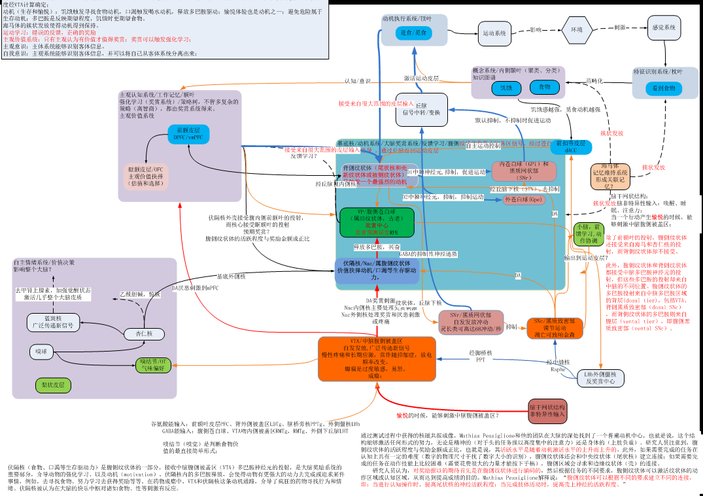
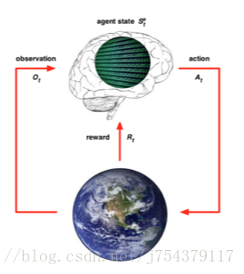

<table style="border:0">
	<tr align="center">
		<td></img>&nbsp;&nbsp;</td>
		<td>winw-java 
			<a style="text-decoration:none">https://github.com/winwjava/winw-java</a></td>
	</tr>
</table>

# 

#人脑的学习方式是强化学习，认知模型是图模型，计算方式是图运算

##强化学习
人脑的主要学习方式是强化学习，通过基底核、海马体和大脑皮层实现，这已经被神经科学所证实，我搜集了一些资料，简单拼接出大脑中的各个功能单元的联系，虽然比较复杂，但可以大胆验证大脑主要依靠强化学习认知世界。

人工智能的专家们对强化学习已经有了很多研究和应用，DeepMind 发表过一篇深度增强学习的著名文章： Human-level control through deep reinforcement learning，下面这个来自网络的图片比较直观的表示了机器如何通过强化学习变得更加智能。

TODO 实验依据，当前有很多多巴胺的强化学习实验，但总体机理非常复杂，不好简单展示。

##认知模型

大脑通过感知器官可以识别：物体、文字、人脸、语音、方向、位置等等，这些识别的模型以及大脑记忆中的模型都是以图为基础的模型。最终通过在自然环境中的强化学习形成庞大的知识图谱。

现在图像识别、人脸识别、语音识别等等都已经在人工智能中被广泛应用，人脸识别是通过提取面部几何特征的方式得到模型，图像识别是通过大量类似图像的训练得到模型。这些模型本质上都是图模型。

2014年的诺贝尔生理学或医学奖由John O’Keefe 、May-Britt Moser 和Edvard Moser 共同获得，表彰他们发现了大脑内部的空间位置细胞、网格细胞。这两种细胞有助于大脑在空间中像GPS一样导航。后来的研究还发现了编码头部朝向的“朝向细胞”、编码边界的“边界细胞”、编码大鼠运动速度的“速度细胞”等。

上图描述了大鼠在空地中的移动轨迹，当动物到达特定位置时，海马（右图彩色所示位置）的位置细胞高速发放电信号。

上图内嗅皮层（右图蓝色指示部位）的网格细胞在大鼠经过六边形网格的节点时发放电信号。

神经科学的这个发现当时给了我非常深刻的印象，不仅找到了大脑中抽象的空间位置表达模型，我认为这也是图模型在大脑认知模型中的最有力的证据（拓扑图是图模型中的一种）。其他的认知行为也与此类似，比如物体识别、形状识别等等。

##时间印记
科学家研究表明，人类大脑海马体中存在一种“时间细胞”，时间细胞的链式信号反映了事件的时间顺序。对于一般的强化学习来说，主观行动Action和行动结果Reward的关系在被学习之前必须存在某种联系，这种联系大部分是有时间先后顺序的关系，而时间细胞组成的时间联系是强化学习的最佳介导关系。

上图描述了大鼠大脑的“事件细胞”（或称“时间细胞”）序列记录了过去事件（味道）、当前事件（声音）和将来事件的关系，组成theta循环。

参考
https://medicalxpress.com/news/2017-06-brain-hippocampus-memories-events.html#jCp

##时序记忆

神经细胞天然带有记忆功能，大脑皮层中的记忆调节维护方式有：长时程增强、长时程抑制，通俗的讲是用进废退。
人脑对特定事物认知后会形成的固定记忆，或可称为概念，科学家已经证实大脑中存在概念细胞，神经科学还发现了对特定运动的记忆会形成时序记忆。

我认为人脑中的记忆大部分是多个视觉片段或语音片段拼凑而成，图模型又是每个片段的基本元素。与计算机的二进制类似，图模型是大脑的基本存储和计算单元。
大脑的视觉系统非常奇妙，视网膜的对比度功能可形成物体轮廓（线条、纹理、形状等），双眼视差有助于建立物体的三维立体模型，还有颜色、方向、运动信息也被传递到大脑视觉皮层。最终在脑海中呈现出了与现实世界非常相似的虚拟映像。

实验1：猕猴对视觉运动信号的感知和检测

A.以动漫中的采样运动为例，图示视觉运动三个特征构成组分: 运动方向、运动速度和运动轨迹。每个霓红灯泡按时间先后顺序，从左到右依次点亮和关闭（闪烁），霓红灯泡之间的闪烁间隔时间在一定范围内，将产生闪烁光斑从左到右运动的错觉。该运动感知不涉及像汽车运动或子弹在飞那样的闪烁霓红灯泡在空间上从左到右的真正位移，而是不同霓红灯泡按时间的先后顺序静止闪烁。
B.结果示意图。本研究发现在猕猴腹侧视觉通路中，V1，V2和V4视区方位功能构筑中的神经元，不仅能够编码轮廓方位和朝向信息，而且还可以编码运动轨迹和速度信息，二者紧密相关。而在V2视区CO染色深的粗条带中的方向敏感性神经元群体对运动方向偏好的编码与运动速度无关。研究结果和发现揭示，灵长类腹侧视觉系统中的各级方位选择性神经元，可以通过神经元感受野线性时空整合机制，编码视网膜上的物体运动轨迹和运动速度，进而感知物体运动。

实验2：延时空间序列回忆任务

上图彩色椭圆为多道电极阵列记录到的神经元集群的感受野。白色虚线圆圈为训练光点的起始位置(S)和终止位置(E)。训练过程中，光点反复从S运动到E，从而反复地引起感受野排布在此路径上的神经元的顺序激活。训练后，即使仅在S闪现一个静止光点也可更频繁地诱发出类似于运动光点所引起的全序列放电。

上面两个实验简单展示了大脑视觉系统对运动信息（时序信息）的采集，以及时序信息（空间位置信息、时间顺序信息）记忆的编码和存储方式。但现在还不能确定时间顺序与空间位置是分开编码，还是联合编码（想象几种烟花的盛开瞬间）。

参考：
http://www.ion.ac.cn/kpwz/201907/t20190703_5332551.html

http://www.ion.ac.cn/xwen/kyjz/2015njyq/201910/t20191010_5406324.html

http://www.ion.ac.cn/xwen/kyjz/2015njyq/201202/t20120214_5315828.html

http://www.ion.ac.cn/xwen/kyjz/2022n/202202/t20220210_6354155.html

##知识图谱
依靠认知模型、时序记忆和强化学习，大脑便可以对周围环境认知积累形成知识图谱。这是成年哺乳动物在原始自然环境中生存的必备技能。

##感知抉择

##模型计算

